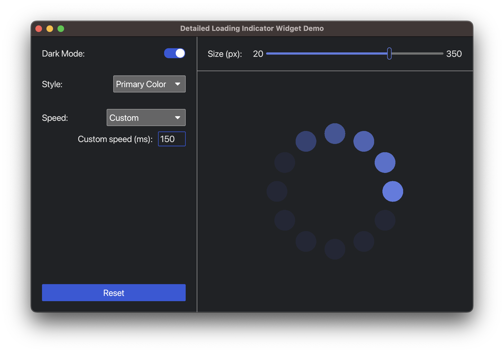

# Iced Loading Indicator Widget

This is a Rust library that exposes a simple [Iced](https://docs.rs/iced/0.10.0/iced/index.html) loading indicator widget that works with Iced's [default renderer](https://docs.rs/iced/0.10.0/iced/type.Renderer.html) and [built-in theme](https://docs.rs/iced/0.10.0/iced/enum.Theme.html).

Internally, the widget uses a canvas to draw the indicator and takes charge of the animation itself by listening to [iced::window::Event::RedrawRequested](https://docs.rs/iced/0.10.0/iced/window/enum.Event.html#variant.RedrawRequested) events and requesting redraws.



## Quick preview


## Compatibility

The current version was developed for [Iced version 0.10](https://docs.rs/iced/0.10.0/iced/index.html).

## Target audience

This library is mainly targeted at Iced users looking for a quick an simple loading indicator widget. However, this project could also be useful to Rust programmers who are in the process of learning Iced, as it uses concepts such as canvas drawing and widget animations. The [detailed](examples/detailed.rs) example could also be useful in that regard.

## How to use the library

I have yet to submit the library to [crates.io](https://crates.io/) (because I want to thoroughly double check it before pushing it over there), so, in the meantime, to use this library in your Iced project, you may simply link to this repository directly from your `Cargo.toml` file as follows:

```
iced-loading-indicator = { git = "https://github.com/BB-301/iced-loading-indicator.git" }
```
### Please note
* You may also want to specify the `rev` property along with `git` in your dependency declaration.
* From inside your Rust program, the library should be referenced as `iced_loading_indicator`.

## How to run the examples

1. Clone the Git repository from GitHub:
```
git clone https://github.com/BB-301/iced-loading-indicator.git
```
2. Move into the cloned repository on your system:
```
cd iced-loading-indicator
```
3. Run the main example:
```
cargo run --example detailed

# ... or
#cargo run --example in_app
#cargo run --example widget
```

### More about the examples
* `detailed`: This is the main, most interesting example, as it allows you to conveniently see how the widget will look under varying scenarios (i.e. size, speed, theme, and color).
* `widget`: This is a simple example that illustrates how to quickly use the widget in an application.
* `in_app`: The libary's API also allows using the loading indicator without the widget; i.e. it lets the application take care of the animation itself. This example shows how to do that, in case this is ever needed.

## Still to do...

* The current version of this widget uses Iced's default renderer and built-in theme. In a subsequent version, it could be interesting to try to replace these types with generics for more flexibility.

## Contact

If you have any questions, if you find bugs, or if you have suggestions for this project, please feel free to contact me by opening an issue on the [repository](https://github.com/BB-301/iced-loading-indicator).

## License

This project is released under the [MIT License](./LICENCE)
